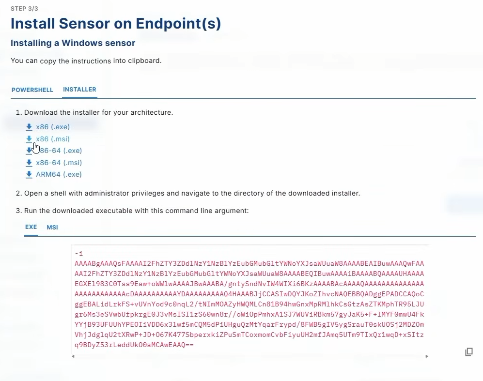
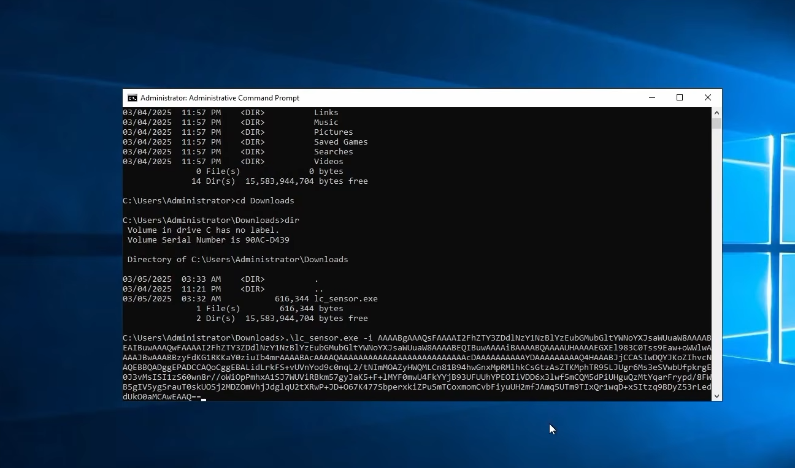

# Phase 1: LimaCharlie Organization & Sensor Deployment

## Purpose
Deploy the LimaCharlie EDR sensor onto the target Windows VM endpoint, establish cloud connectivity, configure Windows artifact log collection, and enable community Sigma rule detection integration.


## 1. LimaCharlie Organization Creation
1. Access the LimaCharlie administrative web console.
2. Create a new organization:
   - **Organization Name:** Configured for the dedicated home lab.
   - **Data Residency:** Configured to the nearest geographic region.
   - **Template:** Set to empty / no preconfigurations.
3. Once provisioned, navigate to the **Installation Keys** view under **Sensor Management**.
4. Generate an installation key:
   - **Description / Key Name:** `WindowsVM - Lab`
   - Copy the generated enrollment key secret for command-line agent deployment.

<!-- Screenshot Placeholder -->
> **Screenshot:** 
> **Timestamp:** <a href="https://www.youtube.com/watch?v=du6_Dk7-a-k&t=3m10s"> </a>

> **Caption:** Generating the "WindowsVM - Lab" installation enrollment key in the LimaCharlie dashboard.


## 2. Sensor Deployment on Target Windows VM
1.  The Windows sensor executable (`lc_sensor.exe`) was pre-staged in the `C:\Users\Administrator\Downloads` folder.

2. Run an elevated command prompt on the Windows target and execute:

```cmd
cd C:\Users\Administrator\Downloads
lc_sensor.exe -i <YOUR_INSTALLATION_KEY_HERE>
```

   - -i: Instructs the agent to register as a system service using the designated key.
   - Upon execution, verify that the sensor initializes and registers back with the cloud console under the Sensors tab.

<!-- Screenshot Placeholder -->
> **Screenshot:** 
> **Timestamp:** <a href="https://www.youtube.com/watch?v=du6_Dk7-a-k&t=4m49s"> </a>

> **Caption:** Executing lc_sensor.exe -i via Windows Command Prompt.


