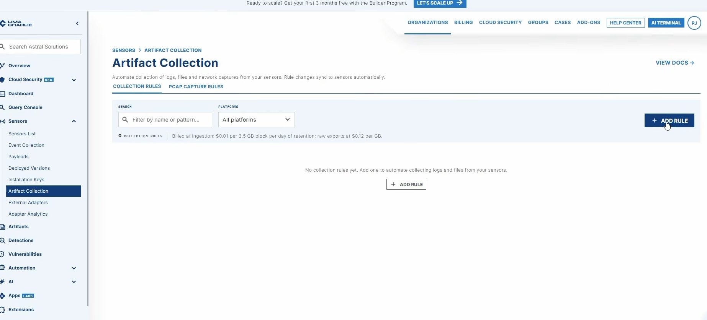
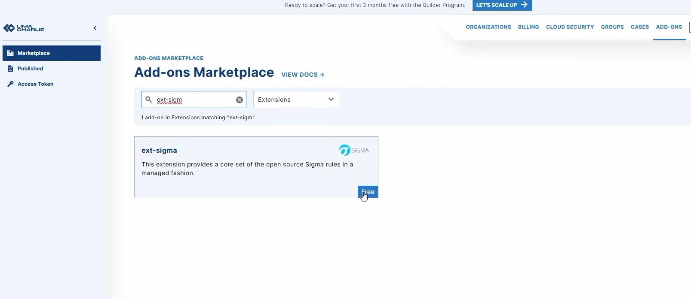

Sysmon & Sigma Pipeline Ingestion

## 1. Artifact Collection Rule:

To ingest low-level Windows operational security events:

1.  Navigate to Artifact Collection in the LimaCharlie left navigation bar.
     
<!-- Screenshot Placeholder -->
> **Screenshot:** 
> **Timestamp:** 

> **Caption:** Adding Artifact rule.

## 4. Sigma Detection Extension

1.  In the upper-right corner of the LimaCharlie console, open Add-ons.
2.  Select Extensions and search for `ext-sigma`
3.  Locate the ext-sigma extension (managed open-source Sigma rule pack for telemetry pattern matching).
4.  Click Subscribe (Free tier) to activate the rule engine.

<!-- Screenshot Placeholder -->
> **Screenshot:** 
> **Timestamp:** 

> **Caption:** Subscribing to the free ext-sigma detection extension.
   
## 2. Command Reference

| Command | Purpose | Notes |
| --------------- | --------------- |--------------- |
| cd C:\Users\Administrator\Downloads | Navigates to payload/executable staging folder | Run from elevated CMD |
| lc_sensor.exe -i <KEY> | nstalls LimaCharlie sensor as a background service | Requires valid org installation key |
