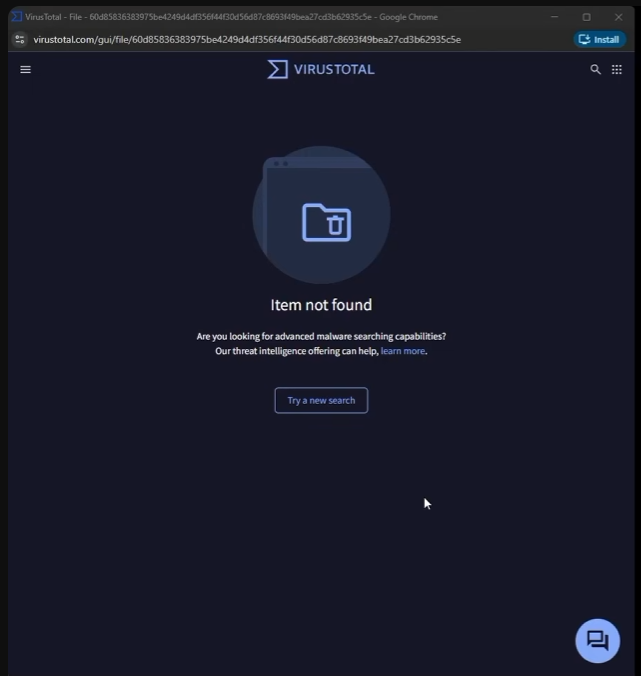

# Phase 4: Detection Analysis and Engineering

## Purpose
Investigate the adversary execution from the defender's perspective inside LimaCharlie EDR. Review process hierarchy, signature integrity, socket bindings, file hash threat intelligence, and construct a detection rule.

## 1. Process Tree and Signature Analysis

1. In LimaCharlie, navigate to **Sensors** -> select the target Windows machine -> **Processes**.
2. Examine the live process tree:
   - Legitimate Windows system processes display valid digital signatures and recognized parentage (`wininit.exe`, `services.exe`, `explorer.exe`).
   - Locate the running implant process.
   - **Anomaly:** The implant binary stands out immediately because it is **unsigned / untrusted** and lacks standard vendor identity metadata.
  
     * Look at the icons next to the process names:
       * Signed Processes: Marked with a green checkmark next to their name.
       * Unsigned Processes: Will lack the green checkmark (and depending on the web UI version, may be explicitly highlighted in yellow).

## 2. Network Activity & File System Inspection
1. Select the **Network** tab for the sensor:
   - Identify an active outbound connection originating from the unsigned binary communicating over port 80 to the attacker Linux VM IP.
2. Select the **File System** tab:
   - Browse to `C:\Users\Administrator\Downloads\`.
   - Locate the implant binary.
   - Click the three-dots menu -> click <a href="https://www.youtube.com/watch?v=du6_Dk7-a-k&t13m25s">**Inspect Hash**</a> to query VirusTotal.
3. **Analyst Takeaway:** VirusTotal reports "Hash Not Found". This is expected because the payload was compiled on-the-fly inside the lab. A missing hash does not mean benign; heuristic and behavioral telemetry take priority over static hash lookups.

**Screenshot:** 
> **Timestamp:** 

> **Caption:** Inspecting the file hash on VirusTotal directly from the LimaCharlie file browser.

## 3. Timeline Reconstruction
1. Open the **Timeline** view in LimaCharlie.
2. Filter or scroll to the timestamp of execution:
   - Correlate:
     1. File download / drop event in the `Downloads` directory.
     2. Process launch (`NEW_PROCESS` / Sysmon Event ID 1).
     3. Network socket initialization (`NETWORK_CONNECTION` / Sysmon Event ID 3).

<!-- Screenshot Placeholder -->
> **Screenshot:** `screenshots/10-limacharlie-endpoint-timeline.png`  
> **Timestamp:** `[00:20:34]`  
> **Caption:** LimaCharlie near-real-time sensor timeline showing sequential process launch and socket creation.

## 4. What's my best approach as a SOC?
  * Triage
    - Verify Hash Context
    - Treat "Hash not found" as untrusted rather than clean
    - Focus on the executable file behavior, establishing outbound network connection from Downloads directory
    - Telemetry Mapping
      -Check Process Creation, Network Connection or EDR network telemetry to isolate the destination IP, port, and protocol
    - Assess access
  * Immediate Containment and Mitigation
    - Isolate the network via EDR, to preserve active session for live memory analysis to severe C2 communication
    - Terminate and Suspend Malicious process, kill active implant PID and any child process
    - Block C2 Ip address and domain/url in the firewall
  * Threat Hunting
    - Look for lateral movement, identical hash, behavior
    - Check if there are newly registered services or any persistent reboots
    - Analyze host discovery activity, whoami, netstat or ps -T or any reconnissance commands automated by C2
      
